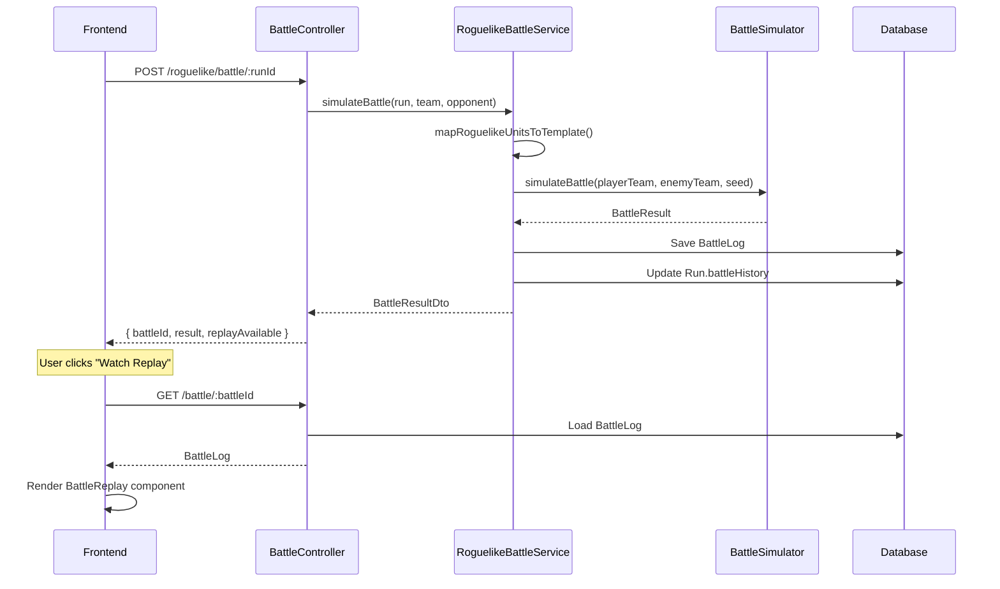

# Design Document: Roguelike Battle Replay

## Overview

This feature integrates the existing battle simulation system into roguelike mode, replacing mock battle results with real simulations and enabling battle replays. The implementation leverages existing components (`battle.simulator.ts`, `BattleReplay.tsx`, `BattleLog` entity) to minimize new code while adding roguelike-specific unit mapping and battle history tracking.

## Architecture



## Components and Interfaces

### 1. RoguelikeBattleService (New)

New service responsible for battle simulation and persistence in roguelike mode.

```typescript
// backend/src/roguelike/battle/battle.service.ts

@Injectable()
export class RoguelikeBattleService {
  constructor(
    @InjectRepository(BattleLog)
    private battleLogRepository: Repository<BattleLog>,
    private runService: RunService,
  ) {}

  /**
   * Simulates a roguelike battle and saves the result.
   * 
   * @param run - Current run state
   * @param playerTeam - Player's placed units
   * @param opponent - Opponent snapshot or bot
   * @returns Battle result with replay availability
   */
  async simulateAndSaveBattle(
    run: RoguelikeRunEntity,
    playerTeam: PlacedUnit[],
    opponent: RoguelikeSnapshotEntity | BotOpponent,
  ): Promise<RoguelikeBattleResult>;

  /**
   * Maps roguelike units to battle-compatible UnitTemplate format.
   * Applies tier-based stat modifiers.
   * 
   * @param units - Roguelike placed units
   * @param faction - Unit faction for data lookup
   * @returns TeamSetup for battle simulator
   */
  mapToTeamSetup(
    units: PlacedUnit[],
    faction: Faction,
  ): TeamSetup;

  /**
   * Generates deterministic seed from run ID and battle number.
   * 
   * @param runId - Run UUID
   * @param battleNumber - Current battle number (wins + losses)
   * @returns Numeric seed for battle simulation
   */
  generateBattleSeed(runId: string, battleNumber: number): number;
}
```

### 2. Unit Mapping Function

Converts roguelike units to battle-compatible format with tier modifiers.

```typescript
// backend/src/roguelike/battle/unit-mapper.ts

/**
 * Maps a roguelike unit to UnitTemplate format.
 * Applies tier-based stat multipliers (T1: ×1.0, T2: ×1.5, T3: ×2.0).
 * 
 * @param unit - Roguelike unit definition
 * @param tier - Unit tier (1, 2, or 3)
 * @returns Battle-compatible UnitTemplate
 */
export function mapRoguelikeUnitToTemplate(
  unit: RoguelikeUnit,
  tier: UnitTier,
): UnitTemplate {
  const multiplier = TIER_STAT_MULTIPLIERS[tier];
  
  return {
    id: unit.id,
    name: unit.name,
    role: mapRoleToLegacy(unit.role), // 'tank' -> 'tank', etc.
    cost: unit.cost,
    range: unit.range,
    abilities: tier === 3 && unit.abilityId ? [unit.abilityId] : [],
    stats: {
      hp: Math.round(unit.hp * multiplier),
      atk: Math.round(unit.atk * multiplier),
      armor: Math.round(unit.armor * multiplier),
      speed: unit.speed,
      initiative: unit.initiative,
      dodge: unit.dodge,
      attackCount: unit.attackCount,
    },
  };
}
```

### 2.1 Ability System Integration

The existing ability system in `game/abilities/ability.data.ts` already contains core types in `core/types/ability.types.ts`. For roguelike T3 abilities:

**Current State:**
- Core types: `core/types/ability.types.ts` — generic ability interfaces ✅
- MVP abilities: `game/abilities/ability.data.ts` — 15 abilities for MVP units ✅

**Required Changes:**
- Add new roguelike T3 abilities to `game/abilities/ability.data.ts`
- Extend `UNIT_ABILITY_MAP` with roguelike unit → ability mappings
- New abilities needed: `divine_shield`, `cleave`, `whirlwind`, `zealous_strike`, `headshot`, `mass_heal`, etc.

```typescript
// Add to game/abilities/ability.data.ts

// New roguelike T3 abilities
const divineShield: ActiveAbility = {
  id: 'divine_shield',
  name: 'Божественный щит',
  description: 'Неуязвимость на 1 ход',
  type: 'active',
  targetType: 'self',
  cooldown: 5,
  range: 0,
  effects: [{ type: 'shield', value: 9999, duration: 1 }],
  icon: 'divine_shield',
};

// Extend UNIT_ABILITY_MAP
export const UNIT_ABILITY_MAP: Record<string, GameAbilityId> = {
  // ... existing MVP mappings ...
  
  // Roguelike T3 units
  footman_t3: 'shield_wall',  // Reuse existing
  knight_t3: 'taunt',         // Reuse existing
  paladin_t3: 'divine_shield', // New
  // ... etc
};
```

### 3. Updated BattleResultDto

Extended DTO to include replay availability flag.

```typescript
// backend/src/roguelike/dto/battle.dto.ts

export class BattleResultDto {
  // ... existing fields ...
  
  @ApiProperty({
    description: 'Whether battle replay is available',
    example: true,
  })
  replayAvailable!: boolean;
}
```

### 4. Frontend Battle Result Component Update

Add "Watch Replay" button to battle result display.

```typescript
// frontend/src/app/run/[id]/battle/page.tsx

// After battle result is shown:
{battleResult && battleResult.replayAvailable && (
  <button
    onClick={() => router.push(`/battle/${battleResult.battleId}`)}
    className="px-4 py-2 bg-blue-600 hover:bg-blue-500 rounded"
  >
    Смотреть реплей
  </button>
)}
```

## Data Models

### BattleHistoryEntry (Updated)

```typescript
// backend/src/roguelike/entities/run.entity.ts

export interface BattleHistoryEntry {
  /** Battle log ID for replay */
  battleId: string;
  /** Battle result */
  result: 'win' | 'loss';
  /** Battle round number (1-based) */
  round: number;
  /** Gold earned from this battle */
  goldEarned: number;
  /** Opponent information */
  opponent: {
    name: string;
    faction: string;
    rating: number;
  };
  /** Battle timestamp */
  timestamp: string;
}
```

### Seed Generation

```typescript
/**
 * Generates deterministic seed from run ID and battle number.
 * Uses simple hash function for reproducibility.
 */
function generateBattleSeed(runId: string, battleNumber: number): number {
  let hash = 0;
  const str = `${runId}-${battleNumber}`;
  for (let i = 0; i < str.length; i++) {
    hash = ((hash << 5) - hash + str.charCodeAt(i)) & 0xffffffff;
  }
  const seed = Math.abs(hash);
  
  // Log seed for debugging (helps reproduce issues)
  this.logger.debug('Battle seed generated', { runId, battleNumber, seed });
  
  return seed;
}
```

**Note:** The battle simulator already uses seeded random from `core/utils/random.ts`, ensuring deterministic behavior when the same seed is provided.

## Correctness Properties

*A property is a characteristic or behavior that should hold true across all valid executions of a system-essentially, a formal statement about what the system should do. Properties serve as the bridge between human-readable specifications and machine-verifiable correctness guarantees.*

### Property 1: Battle result matches simulation output
*For any* roguelike battle with non-empty teams, the returned win/loss result SHALL match the winner field from the battle simulator output.
**Validates: Requirements 1.1, 1.4**

### Property 2: Unit mapping applies tier modifiers correctly
*For any* roguelike unit with tier T, the mapped UnitTemplate stats SHALL equal base stats multiplied by TIER_STAT_MULTIPLIERS[T] (T1: ×1.0, T2: ×1.5, T3: ×2.0).
**Validates: Requirements 1.2, 5.3**

### Property 3: Battle simulation is deterministic
*For any* battle configuration, running simulateBattle twice with the same seed SHALL produce identical BattleResult (same events, same winner).
**Validates: Requirements 1.3**

### Property 4: BattleLog contains complete replay data
*For any* saved BattleLog, it SHALL contain: player1TeamSnapshot, player2TeamSnapshot, events array, winner, and seed.
**Validates: Requirements 2.1, 2.2, 2.3**

### Property 5: Battle history entry has correct structure
*For any* completed battle, the run's battleHistory SHALL contain an entry with: battleId (valid UUID), result ('win' | 'loss'), round (positive integer).
**Validates: Requirements 2.4, 6.1**

### Property 6: API response contains valid battle ID and replay flag
*For any* successful battle submission, the response SHALL contain: battleId (valid UUID), replayAvailable (boolean).
**Validates: Requirements 4.1, 4.2**

### Property 7: Opponent team generation produces valid battle format
*For any* opponent (bot or snapshot), the generated TeamSetup SHALL have: units array with valid UnitTemplates, positions array with valid grid coordinates.
**Validates: Requirements 5.1, 5.2, 5.4**

## Error Handling

### Empty Team Handling
```typescript
// In RoguelikeBattleService.simulateAndSaveBattle()

if (playerTeam.length === 0) {
  // Player has no units - automatic loss
  return this.createAutoLossResult(run, opponent);
}

if (opponentTeam.length === 0) {
  // Opponent has no units - automatic win
  return this.createAutoWinResult(run, opponent);
}
```

### Save Failure Handling
```typescript
// Retry logic for BattleLog save
async saveBattleLogWithRetry(
  battleLog: BattleLog,
  maxRetries: number = 2,
): Promise<{ saved: boolean; id?: string }> {
  for (let attempt = 0; attempt <= maxRetries; attempt++) {
    try {
      const saved = await this.battleLogRepository.save(battleLog);
      return { saved: true, id: saved.id };
    } catch (error) {
      this.logger.warn(`BattleLog save attempt ${attempt + 1} failed`, { error });
      if (attempt === maxRetries) {
        return { saved: false };
      }
    }
  }
  return { saved: false };
}
```

## Testing Strategy

### Dual Testing Approach

This feature requires both unit tests and property-based tests:

1. **Unit Tests**: Verify specific examples and edge cases
2. **Property-Based Tests**: Verify universal properties across random inputs

### Property-Based Testing Library

Use `fast-check` for TypeScript property-based testing.

```typescript
import * as fc from 'fast-check';
```

### Test Structure

Each property-based test MUST:
1. Be tagged with the property number and requirements it validates
2. Run a minimum of 100 iterations
3. Use smart generators that constrain to valid input space

Example:
```typescript
/**
 * **Feature: roguelike-battle-replay, Property 2: Unit mapping applies tier modifiers correctly**
 * **Validates: Requirements 1.2, 5.3**
 */
describe('Property 2: Unit mapping applies tier modifiers', () => {
  it('should apply correct multiplier for each tier', () => {
    fc.assert(
      fc.property(
        roguelikeUnitArbitrary(),
        tierArbitrary(),
        (unit, tier) => {
          const mapped = mapRoguelikeUnitToTemplate(unit, tier);
          const multiplier = TIER_STAT_MULTIPLIERS[tier];
          
          expect(mapped.stats.hp).toBe(Math.round(unit.hp * multiplier));
          expect(mapped.stats.atk).toBe(Math.round(unit.atk * multiplier));
          expect(mapped.stats.armor).toBe(Math.round(unit.armor * multiplier));
        }
      ),
      { numRuns: 100 }
    );
  });
});
```

### Unit Test Coverage

- Empty team edge cases (Requirement 7)
- Save failure handling (Requirement 4.3)
- UI button rendering (Requirement 3.1)
- Navigation to replay page (Requirements 3.2, 6.3)
