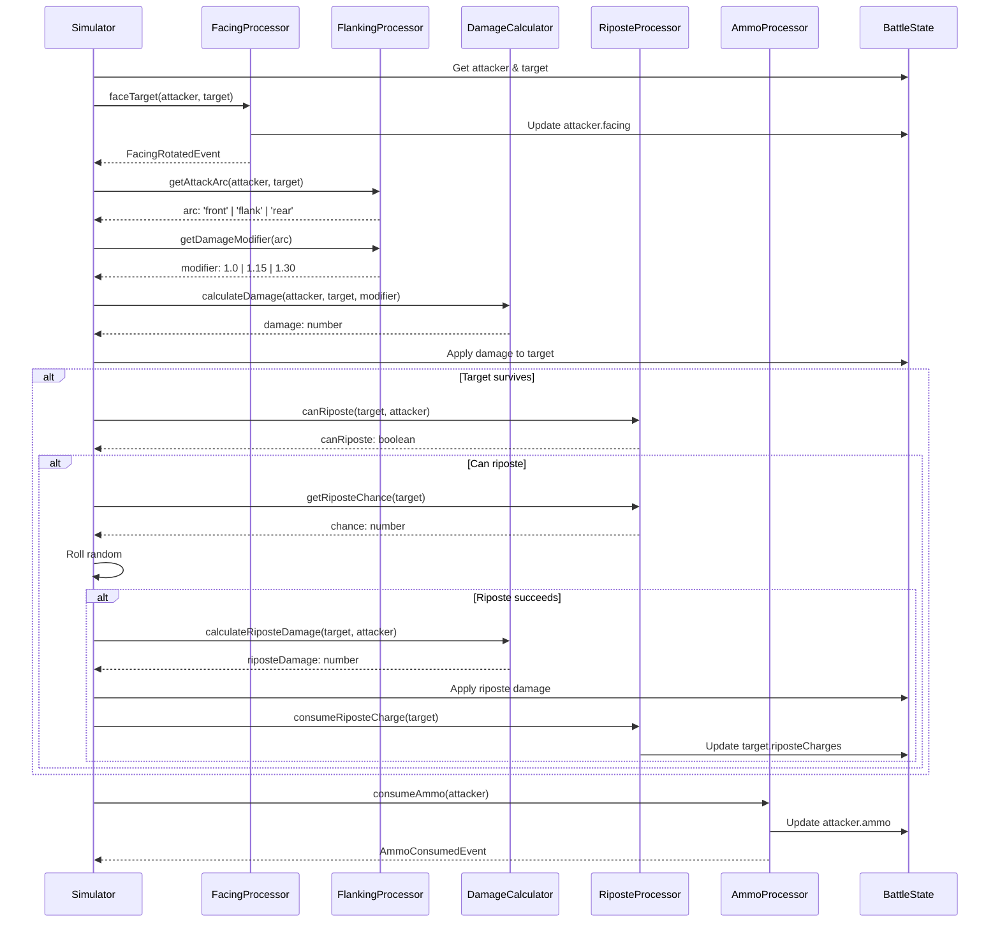

# Design Document: Simulator Refactor

## Overview

Рефакторинг battle simulator для roguelike режима с полной интеграцией Core 2.0 механик. Создаём новый чистый репозиторий с объединённой Core библиотекой (Core 1.0 + Core 2.0), компактным симулятором (<500 строк) и новым API.

### Goals
- Объединить Core 1.0 и Core 2.0 в единую библиотеку
- Создать компактный симулятор с чётким flow фаз
- Удалить legacy код (MVP mode, старый battle.simulator.ts)
- Обеспечить корректную работу всех 14 механик

### Non-Goals
- Поддержка MVP режима
- Обратная совместимость с legacy API
- Frontend рефакторинг (отдельная спека)

## Architecture

### Battle Phase Flow

```mermaid
stateDiagram-v2
    [*] --> BattleStart
    
    BattleStart --> RoundStart: Initialize units
    
    state RoundStart {
        [*] --> BuildTurnQueue
        BuildTurnQueue --> NextUnit
    }
    
    NextUnit --> TurnStart: Unit has turn
    NextUnit --> RoundEnd: No more units
    
    state TurnStart {
        [*] --> ResolveRegen
        ResolveRegen --> ResetRiposte
        ResetRiposte --> CheckRouting
        CheckRouting --> AuraPulse
        AuraPulse --> [*]
    }
    
    TurnStart --> AIDecision
    
    state AIDecision {
        [*] --> EvaluateTargets
        EvaluateTargets --> ChooseAction
        ChooseAction --> [*]: attack/move/ability
    }
    
    AIDecision --> Movement: If moving
    AIDecision --> PreAttack: If attacking
    
    state Movement {
        [*] --> CheckIntercept
        CheckIntercept --> HardIntercept: Spearman blocks cavalry
        CheckIntercept --> SoftIntercept: Infantry engages
        CheckIntercept --> ExecuteMove: No intercept
        HardIntercept --> [*]: Movement stopped
        SoftIntercept --> ExecuteMove
        ExecuteMove --> UpdateEngagement
        UpdateEngagement --> CalculateMomentum: If charging
        CalculateMomentum --> [*]
        UpdateEngagement --> [*]
    }
    
    Movement --> PreAttack: Has target in range
    Movement --> TurnEnd: No target
    
    state PreAttack {
        [*] --> RotateFacing
        RotateFacing --> CalculateFlanking
        CalculateFlanking --> CheckAmmo
        CheckAmmo --> [*]: Has ammo
        CheckAmmo --> TurnEnd: No ammo
    }
    
    PreAttack --> Attack
    
    state Attack {
        [*] --> CalculateDamage
        CalculateDamage --> ApplyModifiers
        
        state ApplyModifiers {
            [*] --> FlankingBonus
            FlankingBonus --> ChargeMomentum
            ChargeMomentum --> ArmorShred
            ArmorShred --> [*]
        }
        
        ApplyModifiers --> RollDodge
        RollDodge --> ApplyDamage: Hit
        RollDodge --> Miss: Dodged
        
        ApplyDamage --> CheckDeath
        CheckDeath --> UnitDied: HP <= 0
        CheckDeath --> CheckRiposte: HP > 0
        
        UnitDied --> ResolveAllyDeath
        ResolveAllyDeath --> [*]
        
        CheckRiposte --> ExecuteRiposte: Front arc + charges
        CheckRiposte --> [*]: No riposte
        
        ExecuteRiposte --> RiposteDamage
        RiposteDamage --> CheckRiposteDeath
        CheckRiposteDeath --> [*]
        
        Miss --> [*]
    }
    
    Attack --> PostAttack
    
    state PostAttack {
        [*] --> ApplyArmorShred
        ApplyArmorShred --> ConsumeAmmo
        ConsumeAmmo --> [*]
    }
    
    PostAttack --> TurnEnd
    
    state TurnEnd {
        [*] --> SpreadContagion
        SpreadContagion --> DecayShred
        DecayShred --> TickCooldowns
        TickCooldowns --> [*]
    }
    
    TurnEnd --> NextUnit
    
    RoundEnd --> CheckBattleEnd
    CheckBattleEnd --> BattleEnd: One team eliminated
    CheckBattleEnd --> RoundStart: Both teams alive
    
    BattleEnd --> [*]
```



### Mechanics Priority Table

| Phase | Mechanics (in order) | Description |
|-------|---------------------|-------------|
| turn_start | resolve → riposte_reset → routing → aura | Regenerate, reset charges, check morale |
| movement | intercept → engagement → charge | Block movement, update ZoC, build momentum |
| pre_attack | facing → flanking → ammo_check | Rotate, calculate arc, verify ammo |
| attack | damage → dodge → riposte | Calculate damage, roll dodge, counter-attack |
| post_attack | armor_shred → ammo_consume | Degrade armor, spend ammunition |
| turn_end | contagion → shred_decay → cooldowns | Spread effects, decay debuffs, tick abilities |

### Attack Sequence Diagram



### Mechanics Formulas

#### Damage Calculation

```
Physical Damage = max(1, (ATK - effectiveArmor) * atkCount * flankingModifier * chargeModifier)

Where:
- effectiveArmor = armor - armorShred
- flankingModifier = 1.0 (front) | 1.15 (flank) | 1.30 (rear)
- chargeModifier = 1.0 + (momentum * 0.1)  // 10% per momentum point
```

#### Flanking Bonus

```
Attack Arc Determination:
- Front: attacker is within ±45° of target's facing direction
- Flank: attacker is within 45°-135° of target's facing direction  
- Rear: attacker is within ±45° of opposite to target's facing direction

Damage Modifiers:
- Front: 1.0x (no bonus)
- Flank: 1.15x (+15% damage)
- Rear: 1.30x (+30% damage)
```

#### Riposte Chance

```
Base Riposte Chance = 30%

Initiative Modifier:
- If defender.initiative > attacker.initiative:
  bonus = (defender.initiative - attacker.initiative) * 2%
  finalChance = min(60%, baseChance + bonus)
- Else:
  finalChance = baseChance

Conditions for Riposte:
1. Defender has riposteCharges > 0
2. Attacker is in defender's front arc
3. Defender is not stunned/routing
4. Random roll < finalChance
```

#### Resolve System

```
Resolve Regeneration (per turn):
- Base: +5 resolve
- In phalanx: +3 additional resolve

Resolve Damage:
- Adjacent ally dies: -15 resolve
- Nearby ally dies (≤3 cells): -8 resolve
- Surrounded (3+ enemies adjacent): -20 resolve
- Flanking attack received: -5 resolve
- Rear attack received: -10 resolve

Routing:
- Human units route when resolve = 0
- Rally when resolve ≥ 25
- Undead crumble (die) when resolve = 0
```

#### Charge Momentum

```
Momentum Calculation:
- momentum = distance_moved (cells)
- Max momentum = 5

Charge Damage Bonus:
- bonusDamage = baseDamage * (momentum * 0.1)
- Example: 3 cells moved = +30% damage

Spear Wall Counter:
- If target has 'spearman' tag and is facing charger:
  - Charge is stopped
  - Charger takes counterDamage = target.ATK * 0.5
  - Momentum reset to 0
```

#### Ammunition

```
Ranged Units:
- Archer: 12 arrows
- Crossbowman: 8 bolts
- Hunter: 10 arrows

Mage Units:
- Mage: 3 fireballs (cooldown: 2 turns)
- Warlock: 4 drain_life (cooldown: 1 turn)
- Elementalist: 3 chain_lightning (cooldown: 2 turns)

When ammo = 0 (Ranged Units):
- Range reduced to 1 (melee only)
- ATK reduced to 50% of base
- Unit must move adjacent to target to attack
- Cannot use ranged abilities

When ammo = 0 (Mage Units):
- Cannot use special abilities
- Use basic attack (range = 1, ATK = base ATK)
- Cooldown-based abilities regenerate over turns
```

#### Phalanx Formation

```
Formation Detection:
- Unit is in phalanx if 2+ allies are adjacent (orthogonally)
- All adjacent allies must be alive
- Diagonal adjacency does not count

Phalanx Bonuses:
- Armor: +2 per adjacent ally (max +6 with 3 allies)
- Resolve: +3 per adjacent ally (max +9)
- Resolve regeneration: +3 per turn while in phalanx

Phalanx Weakness:
- Contagion spread chance increased by 20% in phalanx
- If one unit routes, adjacent units take -10 resolve

Recalculation:
- Phalanx status recalculated after any unit moves or dies
- Bonuses removed immediately when formation breaks
```

#### Contagion (Status Spread)

```
Spread Mechanics:
- At turn_end, each status effect may spread to adjacent units
- Only spreads to units of the same team (friendly fire)
- Each effect has base spread chance

Spread Chances:
- Fire: 30% base, +20% if target in phalanx
- Poison: 25% base, +15% if target in phalanx
- Fear: 40% base (morale effects spread faster)
- Stun: 0% (does not spread)

Spread Rules:
- Effect spreads with reduced duration (original - 1, min 1)
- Same effect cannot stack, but refreshes duration
- Spread blocked if target has immunity
```

#### Engagement / Zone of Control

```
Zone of Control (ZoC):
- Each unit projects ZoC to all 4 orthogonally adjacent cells
- Entering enemy ZoC triggers engagement

Engagement Effects:
- Engaged units cannot move without disengaging
- Ranged units in engagement: -50% ATK penalty
- Engaged units cannot use abilities requiring movement

Disengagement:
- Costs 2 movement points (half of typical speed)
- Triggers Attack of Opportunity from engaging unit
- AoO deals 50% of normal attack damage
- AoO does not consume attacker's turn
```

#### Intercept

```
Hard Intercept (Spearmen vs Cavalry):
- Triggers when cavalry moves within 2 cells of spearman
- Spearman must be facing the cavalry
- Cavalry movement is stopped
- Cavalry takes counter damage = spearman.ATK * 0.5
- Cavalry momentum reset to 0

Soft Intercept (Infantry):
- Triggers when any unit moves adjacent to infantry
- Moving unit becomes engaged
- No damage dealt
- Moving unit can continue if has remaining movement

Intercept Priority:
- Hard intercept checked first
- Soft intercept checked if hard intercept doesn't apply
- Only one intercept per movement action
```

#### Overwatch (Vigilance Mode)

```
Activation:
- Unit skips attack to enter Overwatch stance
- Overwatch lasts until unit's next turn or triggered

Trigger Conditions:
- Enemy unit moves within unit's attack range
- Enemy unit uses ability within range
- Only triggers once per Overwatch activation

Overwatch Attack:
- Deals 75% of normal attack damage
- Consumes ammunition if ranged
- Interrupts enemy movement (enemy stops at trigger point)

Overwatch Limitations:
- Cannot Overwatch if engaged
- Cannot Overwatch if routing
- Overwatch ends at start of unit's next turn
```

#### Line of Sight (LoS)

```
Direct Fire (Archers, Crossbowmen):
- Requires clear line to target
- Blocked by any unit (friend or foe) in the path
- Uses Bresenham line algorithm

Arc Fire (Siege, some abilities):
- Ignores obstacles between shooter and target
- -20% accuracy penalty
- Cannot target units adjacent to shooter

LoS Calculation:
- Draw line from shooter center to target center
- Check each cell along the line
- If any cell contains a unit (except shooter/target), LoS blocked

Partial Cover:
- If LoS passes through cell edge, 50% chance to hit cover
- Cover provides +20% dodge bonus to target
```

#### Armor Shred

```
Shred Application:
- Each physical attack applies shred = attacker.ATK * 0.1
- Shred accumulates on target
- Max shred = target.baseArmor (cannot go negative)

Effective Armor:
- effectiveArmor = max(0, baseArmor - armorShred)
- Affects all physical damage calculations

Shred Decay:
- At turn_end, shred decays by 2 points
- Minimum shred = 0
- Decay happens after contagion spread

Shred Immunity:
- Some units have 'armored' tag: shred capped at 50% of armor
- Undead units: no shred decay (permanent until death)
```

### API Endpoints

#### Run Management

```
POST /api/run/start
Request: { factionId: string, leaderId: string }
Response: { 
  runId: string,
  initialDeck: UnitCard[],
  budget: number,
  stage: 1
}

GET /api/run/:runId
Response: {
  runId: string,
  stage: number,
  wins: number,
  losses: number,
  budget: number,
  deck: UnitCard[],
  upgrades: UpgradeRecord[]
}

POST /api/run/:runId/abandon
Response: { success: boolean }
```

#### Battle

```
POST /api/battle/start
Request: {
  runId: string,
  playerTeam: {
    units: { unitId: string, position: Position }[]
  }
}
Response: {
  battleId: string,
  enemyTeam: TeamSnapshot,
  seed: number
}

POST /api/battle/:battleId/simulate
Request: { } // Uses stored teams
Response: {
  result: 'win' | 'loss',
  events: BattleEvent[],
  finalState: FinalBattleState,
  rewards?: BattleRewards
}

GET /api/battle/:battleId/replay
Response: {
  events: BattleEvent[],
  initialState: BattleState
}
```

#### Draft

```
GET /api/draft/:runId/options
Response: {
  options: UnitCard[],  // 3 cards to choose from
  rerollsRemaining: number
}

POST /api/draft/:runId/pick
Request: { cardId: string }
Response: {
  success: boolean,
  deck: UnitCard[]
}

POST /api/draft/:runId/reroll
Response: {
  options: UnitCard[],
  rerollsRemaining: number
}
```

#### Upgrade

```
GET /api/upgrade/:runId/available
Response: {
  upgradeable: {
    unitId: string,
    currentTier: number,
    nextTier: number,
    cost: number
  }[]
}

POST /api/upgrade/:runId/upgrade
Request: { unitId: string }
Response: {
  success: boolean,
  unit: UnitCard,
  remainingGold: number
}
```

### Database Schema

```sql
-- Runs table
CREATE TABLE runs (
  id UUID PRIMARY KEY,
  player_id UUID REFERENCES players(id),
  faction_id VARCHAR(50) NOT NULL,
  leader_id VARCHAR(50) NOT NULL,
  stage INTEGER DEFAULT 1,
  wins INTEGER DEFAULT 0,
  losses INTEGER DEFAULT 0,
  budget INTEGER DEFAULT 10,
  gold INTEGER DEFAULT 0,
  status VARCHAR(20) DEFAULT 'active', -- active, won, lost, abandoned
  created_at TIMESTAMP DEFAULT NOW(),
  updated_at TIMESTAMP DEFAULT NOW()
);

-- Run deck (units in current run)
CREATE TABLE run_deck (
  id UUID PRIMARY KEY,
  run_id UUID REFERENCES runs(id) ON DELETE CASCADE,
  unit_id VARCHAR(50) NOT NULL,
  tier INTEGER DEFAULT 1,
  position INTEGER, -- order in deck
  created_at TIMESTAMP DEFAULT NOW()
);

-- Battles table
CREATE TABLE battles (
  id UUID PRIMARY KEY,
  run_id UUID REFERENCES runs(id),
  enemy_snapshot_id UUID REFERENCES snapshots(id),
  seed INTEGER NOT NULL,
  result VARCHAR(10), -- win, loss, null if not completed
  events JSONB,
  created_at TIMESTAMP DEFAULT NOW()
);

-- Player snapshots for async PvP
CREATE TABLE snapshots (
  id UUID PRIMARY KEY,
  player_id UUID REFERENCES players(id),
  run_id UUID REFERENCES runs(id),
  stage INTEGER NOT NULL,
  team JSONB NOT NULL, -- { units: [], positions: [] }
  wins INTEGER NOT NULL,
  created_at TIMESTAMP DEFAULT NOW()
);

-- Bot teams (fallback when no snapshots)
CREATE TABLE bot_teams (
  id UUID PRIMARY KEY,
  stage INTEGER NOT NULL,
  difficulty INTEGER NOT NULL, -- 1-10
  team JSONB NOT NULL,
  created_at TIMESTAMP DEFAULT NOW()
);

-- Indexes
CREATE INDEX idx_runs_player ON runs(player_id);
CREATE INDEX idx_runs_status ON runs(status);
CREATE INDEX idx_snapshots_stage ON snapshots(stage);
CREATE INDEX idx_bot_teams_stage ON bot_teams(stage, difficulty);
```

### Migration Guide

#### Files to Copy from Old Repository

```
FROM: backend/src/core/
├── grid/                    ✅ Copy entirely
│   ├── grid.ts
│   └── pathfinding.ts
├── battle/                  ✅ Copy entirely
│   ├── damage.ts
│   ├── turn-order.ts
│   └── targeting.ts
├── mechanics/               ✅ Copy entirely (all tiers)
│   ├── config/
│   ├── tier0/ through tier4/
│   └── processor.ts
├── progression/             ✅ Copy entirely
│   ├── deck/
│   ├── draft/
│   ├── run/
│   └── snapshot/
├── types/                   ✅ Copy and merge
└── utils/                   ✅ Copy entirely

FROM: backend/src/game/
├── units/                   ✅ Copy entirely
├── abilities/               ✅ Copy entirely
└── factions/                ✅ Copy if exists
```

#### Files to DELETE (Legacy)

```
❌ backend/src/battle/battle.simulator.ts (2400+ lines)
❌ backend/src/battle/actions.ts (MVP-specific)
❌ backend/src/battle/mechanics-integration.ts (conversion layer)
❌ backend/src/matchmaking/ (real-time PvP queue)
❌ backend/src/team/ (MVP team builder)
❌ All MVP-specific tests
❌ All files with "mvp" or "legacy" in name
```

#### Files to REWRITE

```
🔄 backend/src/battle/battle.service.ts → src/api/battle/battle.service.ts
🔄 backend/src/battle/ability.executor.ts → src/simulator/abilities.ts
🔄 backend/src/battle/ai.decision.ts → src/simulator/ai/decision.ts
🔄 backend/src/types/game.types.ts → src/core/types/index.ts (unified)
```

### Code Examples for Each Mechanic

#### Facing Mechanic

```typescript
import { FacingProcessor } from '@core/mechanics/tier0/facing';

// Rotate unit to face target before attack
const facingResult = FacingProcessor.faceTarget(
  state,
  attackerId,
  targetId
);

// Get attack arc for flanking calculation
const arc = FacingProcessor.getAttackArc(
  attacker.position,
  attacker.facing,
  target.position
);
// Returns: 'front' | 'flank' | 'rear'
```

#### Riposte Mechanic

```typescript
import { RiposteProcessor } from '@core/mechanics/tier2/riposte';

// Check if defender can riposte
const canRiposte = RiposteProcessor.canRiposte(
  defender,
  attacker,
  attackArc  // Must be 'front'
);

if (canRiposte) {
  // Calculate riposte chance based on Initiative
  const chance = RiposteProcessor.getRiposteChance(
    defender.stats.initiative,
    attacker.stats.initiative
  );
  
  if (rng.next() < chance) {
    // Execute riposte counter-attack
    const riposteResult = RiposteProcessor.executeRiposte(
      state,
      defenderId,
      attackerId
    );
    state = riposteResult.state;
    events.push(...riposteResult.events);
  }
}
```

#### Ammunition Mechanic

```typescript
import { AmmunitionProcessor } from '@core/mechanics/tier3/ammunition';

// Check if unit can attack (has ammo)
const canAttack = AmmunitionProcessor.canAttack(attacker);

if (!canAttack) {
  // Switch to melee or skip attack
  if (attacker.range > 1) {
    // Ranged unit out of ammo - melee attack at reduced damage
    attacker = { ...attacker, range: 1 };
  }
}

// After attack, consume ammo
const ammoResult = AmmunitionProcessor.consume(state, attackerId);
state = ammoResult.state;
events.push({
  type: 'ammo_consumed',
  unitId: attackerId,
  remaining: ammoResult.state.units.find(u => u.instanceId === attackerId)?.ammo
});
```

#### Charge Mechanic

```typescript
import { ChargeProcessor } from '@core/mechanics/tier3/charge';

// Calculate momentum based on movement distance
const momentum = ChargeProcessor.calculateMomentum(
  startPosition,
  endPosition
);

// Apply charge bonus to damage
const chargeBonus = ChargeProcessor.getChargeBonus(momentum);
const finalDamage = baseDamage * (1 + chargeBonus);

// Check for spear wall counter
if (ChargeProcessor.isCounteredBySpearWall(attacker, target)) {
  const counterResult = ChargeProcessor.applySpearWallCounter(
    state,
    attackerId,
    targetId
  );
  // Charge stopped, attacker takes damage
  state = counterResult.state;
  events.push(...counterResult.events);
}
```

#### Resolve Mechanic

```typescript
import { ResolveProcessor } from '@core/mechanics/tier1/resolve';

// Regenerate resolve at turn start
const regenResult = ResolveProcessor.regenerate(state, unitId);
state = regenResult.state;

// Apply resolve damage when ally dies
const allyDeathResult = ResolveProcessor.applyAllyDeathDamage(
  state,
  deadUnitId,
  deadUnitPosition
);
state = allyDeathResult.state;

// Check routing status
const routingStatus = ResolveProcessor.checkRoutingStatus(unit);
if (routingStatus === 'route') {
  // Unit starts routing - can only retreat
  state = ResolveProcessor.startRouting(state, unitId);
} else if (routingStatus === 'rally') {
  // Unit rallies - can act normally again
  state = ResolveProcessor.rally(state, unitId);
}
```

### Project Structure

```
┌─────────────────────────────────────────────────────────────────┐
│                        New Repository                           │
├─────────────────────────────────────────────────────────────────┤
│  src/                                                           │
│  ├── core/                    # Unified Core Library            │
│  │   ├── types/               # BattleState, BattleUnit, etc.   │
│  │   ├── grid/                # Grid utilities, A* pathfinding  │
│  │   ├── battle/              # Damage, turn-order, targeting   │
│  │   ├── mechanics/           # All 14 mechanics processors     │
│  │   └── index.ts             # Public API exports              │
│  │                                                              │
│  ├── simulator/               # Battle Simulator (<500 lines)   │
│  │   ├── simulator.ts         # Main simulation loop            │
│  │   ├── phases/              # Phase handlers                  │
│  │   │   ├── turn-start.ts                                      │
│  │   │   ├── movement.ts                                        │
│  │   │   ├── attack.ts                                          │
│  │   │   └── turn-end.ts                                        │
│  │   ├── ai/                  # AI decision making              │
│  │   └── events.ts            # Event emitter                   │
│  │                                                              │
│  ├── roguelike/               # Roguelike game logic            │
│  │   ├── run/                 # Run progression                 │
│  │   ├── draft/               # Card drafting                   │
│  │   ├── upgrade/             # Unit upgrades                   │
│  │   └── snapshot/            # Async PvP matchmaking           │
│  │                                                              │
│  ├── game/                    # Game-specific content           │
│  │   ├── units/               # Unit definitions                │
│  │   ├── abilities/           # Ability data                    │
│  │   └── factions/            # Faction definitions             │
│  │                                                              │
│  └── api/                     # REST API (NestJS)               │
│      ├── run/                 # Run endpoints                   │
│      ├── battle/              # Battle endpoints                │
│      └── draft/               # Draft endpoints                 │
└─────────────────────────────────────────────────────────────────┘
```

## Components and Interfaces

### Core Types (src/core/types/)

```typescript
/**
 * Direction a unit is facing on the battlefield.
 * Determines attack arc and flanking calculations.
 */
type FacingDirection = 'N' | 'S' | 'E' | 'W';

/**
 * Battle unit with all Core 2.0 mechanic properties.
 * Single unified type - no conversion layers needed.
 */
interface BattleUnit {
  // Identity
  id: string;
  instanceId: string;
  name: string;
  team: 'player' | 'enemy';
  
  // Base stats
  stats: {
    hp: number;
    atk: number;
    atkCount: number;
    armor: number;
    speed: number;
    initiative: number;
    dodge: number;
  };
  range: number;
  role: string;
  cost: number;
  abilities: string[];
  
  // Battle state
  position: { x: number; y: number };
  currentHp: number;
  maxHp: number;
  alive: boolean;
  
  // Core 2.0 Mechanics
  facing: FacingDirection;
  resolve: number;
  maxResolve: number;
  isRouting: boolean;
  engaged: boolean;
  engagedBy: string[];
  riposteCharges: number;
  ammo: number | null;        // null = unlimited (melee)
  maxAmmo: number | null;
  momentum: number;
  armorShred: number;
  inPhalanx: boolean;
  tags: string[];             // 'cavalry', 'spearman', etc.
  faction: 'human' | 'undead';
}

/**
 * Immutable battle state.
 */
interface BattleState {
  units: readonly BattleUnit[];
  round: number;
  turn: number;
  events: readonly BattleEvent[];
  occupiedPositions: ReadonlySet<string>;
  seed: number;
}

/**
 * Phase context passed to mechanics processors.
 */
interface PhaseContext {
  phase: Phase;
  actorId: string;
  targetId?: string;
  action?: BattleAction;
  state: BattleState;
}

type Phase = 
  | 'turn_start' 
  | 'ai_decision'
  | 'movement' 
  | 'pre_attack' 
  | 'attack' 
  | 'post_attack' 
  | 'turn_end';
```

### Simulator Interface (src/simulator/)

```typescript
/**
 * Main battle simulation function.
 * Pure function - same inputs always produce same outputs.
 * 
 * @param playerTeam - Player's team setup
 * @param enemyTeam - Enemy team setup (snapshot or bot)
 * @param seed - Random seed for determinism
 * @returns Battle result with events and final state
 */
function simulateBattle(
  playerTeam: TeamSetup,
  enemyTeam: TeamSetup,
  seed: number
): BattleResult;

/**
 * Execute a single turn for one unit.
 * Called by main simulation loop.
 */
function executeTurn(
  state: BattleState,
  unitId: string,
  rng: SeededRandom
): { state: BattleState; events: BattleEvent[] };
```

### Phase Handlers (src/simulator/phases/)

```typescript
/**
 * Turn start phase handler.
 * - Regenerate resolve
 * - Reset riposte charges
 * - Check routing/rally status
 * - Apply aura pulses
 */
function handleTurnStart(
  state: BattleState,
  unitId: string
): { state: BattleState; events: BattleEvent[] };

/**
 * Movement phase handler.
 * - Execute AI-decided movement
 * - Check intercept triggers
 * - Update engagement status
 * - Calculate charge momentum
 */
function handleMovement(
  state: BattleState,
  unitId: string,
  targetPosition: Position,
  rng: SeededRandom
): { state: BattleState; events: BattleEvent[] };

/**
 * Attack phase handler.
 * - Rotate facing toward target
 * - Calculate flanking bonus
 * - Apply damage with modifiers
 * - Trigger riposte if applicable
 * - Consume ammunition
 */
function handleAttack(
  state: BattleState,
  attackerId: string,
  targetId: string,
  rng: SeededRandom
): { state: BattleState; events: BattleEvent[] };

/**
 * Turn end phase handler.
 * - Spread contagion effects
 * - Decay armor shred
 * - Tick cooldowns
 */
function handleTurnEnd(
  state: BattleState,
  unitId: string
): { state: BattleState; events: BattleEvent[] };
```

## Data Models

### Battle Events

```typescript
/**
 * Base event structure for all battle events.
 */
interface BattleEvent {
  type: string;
  round: number;
  turn: number;
  timestamp: number;
  actorId?: string;
  targetId?: string;
  metadata: Record<string, unknown>;
}

/**
 * Mechanic-specific events.
 */
type MechanicEvent =
  | { type: 'facing_rotated'; actorId: string; from: FacingDirection; to: FacingDirection }
  | { type: 'flanking_applied'; attackerId: string; targetId: string; arc: 'front' | 'flank' | 'rear'; modifier: number }
  | { type: 'riposte_triggered'; defenderId: string; attackerId: string; damage: number }
  | { type: 'ammo_consumed'; unitId: string; remaining: number }
  | { type: 'charge_impact'; attackerId: string; targetId: string; momentum: number; bonusDamage: number }
  | { type: 'resolve_changed'; unitId: string; delta: number; newValue: number; source: string }
  | { type: 'routing_started'; unitId: string }
  | { type: 'unit_rallied'; unitId: string }
  | { type: 'phalanx_formed'; unitIds: string[]; armorBonus: number }
  | { type: 'contagion_spread'; fromId: string; toId: string; effect: string };
```

### API Request/Response

```typescript
/**
 * Start a new roguelike run.
 */
interface StartRunRequest {
  factionId: string;
  leaderId: string;
}

interface StartRunResponse {
  runId: string;
  initialDeck: UnitCard[];
  budget: number;
  stage: number;
}

/**
 * Execute a battle in the run.
 */
interface BattleRequest {
  runId: string;
  playerTeam: TeamSetup;
}

interface BattleResponse {
  battleId: string;
  result: 'win' | 'loss';
  events: BattleEvent[];
  finalState: {
    playerUnits: FinalUnitState[];
    enemyUnits: FinalUnitState[];
  };
  rewards?: {
    gold: number;
    draftOptions: UnitCard[];
  };
}
```

## Correctness Properties

*A property is a characteristic or behavior that should hold true across all valid executions of a system-essentially, a formal statement about what the system should do. Properties serve as the bridge between human-readable specifications and machine-verifiable correctness guarantees.*

### Property 1: Phase Order Invariant
*For any* battle simulation, events SHALL be emitted in strict phase order: turn_start → movement → pre_attack → attack → post_attack → turn_end, with no phase appearing out of sequence within a turn.
**Validates: Requirements 1.3, 2.2**

### Property 2: Dead Units Never Act
*For any* battle state, if a unit has `alive === false`, that unit SHALL NOT appear as the actor in any subsequent action event (attack, move, ability).
**Validates: Requirements 3.3, 6.1**

### Property 3: HP Bounds
*For any* unit at any point during battle, `currentHp` SHALL satisfy: `0 <= currentHp <= maxHp`.
**Validates: Requirements 6.2**

### Property 4: Ammunition Non-Negative
*For any* unit with `ammo !== null`, the value SHALL satisfy: `ammo >= 0` at all times.
**Validates: Requirements 6.3**

### Property 5: Facing Validity
*For any* unit at any point during battle, `facing` SHALL be one of: 'N', 'S', 'E', 'W'.
**Validates: Requirements 6.4**

### Property 6: Battle Termination
*For any* battle simulation, the battle SHALL terminate within MAX_ROUNDS (100) with a definitive winner or draw.
**Validates: Requirements 6.5**

### Property 7: Immutable State Updates
*For any* state update operation, the original state object SHALL NOT be mutated; a new state object SHALL be returned.
**Validates: Requirements 3.1**

### Property 8: Mechanic Property Preservation
*For any* unit that takes damage, all mechanic-specific properties (facing, resolve, ammo, riposteCharges) SHALL be preserved in the updated state.
**Validates: Requirements 3.2**

### Property 9: Riposte Charge Reset
*For any* unit at the start of their turn, `riposteCharges` SHALL be reset to the configured maximum value.
**Validates: Requirements 2.3, 3.4**

### Property 10: Facing Rotation on Attack
*For any* attack action, the attacker's facing SHALL be updated to point toward the target before damage calculation.
**Validates: Requirements 2.5**

### Property 11: Bot Team Budget Constraint
*For any* generated bot team, the total cost of units SHALL NOT exceed the budget for the current run stage.
**Validates: Requirements 8.3**

### Property 12: Matchmaking Always Returns Opponent
*For any* matchmaking request, the system SHALL return either a valid player snapshot or a generated bot team.
**Validates: Requirements 5.4, 8.1**

## Error Handling

### Battle Simulation Errors

```typescript
/**
 * Error thrown when battle state becomes invalid.
 */
class BattleStateError extends Error {
  constructor(
    message: string,
    public readonly battleId: string,
    public readonly state: Partial<BattleState>,
    public readonly cause?: Error
  ) {
    super(message);
    this.name = 'BattleStateError';
  }
}

/**
 * Error thrown when mechanic preconditions are not met.
 */
class MechanicError extends Error {
  constructor(
    message: string,
    public readonly mechanic: string,
    public readonly unitId: string,
    public readonly context: Record<string, unknown>
  ) {
    super(message);
    this.name = 'MechanicError';
  }
}
```

### Logging Strategy

```typescript
/**
 * Structured log format for battle events.
 */
interface BattleLog {
  level: 'debug' | 'info' | 'warn' | 'error';
  timestamp: string;
  battleId: string;
  round?: number;
  turn?: number;
  phase?: Phase;
  unitId?: string;
  mechanic?: string;
  message: string;
  data?: Record<string, unknown>;
}

// Example usage:
logger.debug({
  battleId: 'battle_123',
  round: 3,
  turn: 7,
  phase: 'attack',
  unitId: 'player_knight_0',
  mechanic: 'riposte',
  message: 'Riposte triggered',
  data: { targetId: 'enemy_rogue_1', damage: 15, chance: 0.45 }
});
```

## Testing Strategy

### Dual Testing Approach

**Unit Tests**: Verify specific examples and edge cases
- Individual phase handlers
- Mechanic processors
- Damage calculations
- AI decisions

**Property-Based Tests**: Verify universal properties across all inputs
- Use fast-check library for TypeScript
- Minimum 100 iterations per property
- Custom generators for valid battle states

### Property-Based Testing Framework

```typescript
import * as fc from 'fast-check';

/**
 * Generator for valid BattleUnit.
 */
const battleUnitArb = fc.record({
  id: fc.string(),
  instanceId: fc.uuid(),
  position: fc.record({ x: fc.integer(0, 7), y: fc.integer(0, 9) }),
  currentHp: fc.integer(1, 100),
  maxHp: fc.integer(1, 100),
  alive: fc.boolean(),
  facing: fc.constantFrom('N', 'S', 'E', 'W'),
  resolve: fc.integer(0, 100),
  ammo: fc.option(fc.integer(0, 20)),
  // ... other properties
}).filter(u => u.currentHp <= u.maxHp);

/**
 * Generator for valid BattleState.
 */
const battleStateArb = fc.record({
  units: fc.array(battleUnitArb, { minLength: 2, maxLength: 12 }),
  round: fc.integer(1, 100),
  seed: fc.integer(),
});

// Example property test
describe('Battle Simulator Properties', () => {
  it('Property 2: Dead units never act', () => {
    fc.assert(
      fc.property(battleStateArb, fc.integer(), (initialState, seed) => {
        const result = simulateBattle(
          { units: initialState.units.filter(u => u.team === 'player'), positions: [] },
          { units: initialState.units.filter(u => u.team === 'enemy'), positions: [] },
          seed
        );
        
        // Check that no dead unit appears as actor
        const deadUnitIds = new Set(
          result.events
            .filter(e => e.type === 'unit_died')
            .map(e => e.targetId)
        );
        
        const actionsAfterDeath = result.events.filter(e => 
          e.actorId && deadUnitIds.has(e.actorId) &&
          ['attack', 'move', 'ability'].includes(e.type)
        );
        
        return actionsAfterDeath.length === 0;
      }),
      { numRuns: 100 }
    );
  });
});
```

### Test File Structure

```
src/
├── core/
│   └── mechanics/
│       └── __tests__/
│           ├── facing.spec.ts
│           ├── flanking.spec.ts
│           ├── riposte.spec.ts
│           └── ...
├── simulator/
│   └── __tests__/
│       ├── simulator.spec.ts           # Unit tests
│       ├── simulator.property.spec.ts  # Property tests
│       ├── phases/
│       │   ├── turn-start.spec.ts
│       │   ├── attack.spec.ts
│       │   └── ...
│       └── fixtures/
│           ├── teams.ts
│           └── states.ts
└── roguelike/
    └── __tests__/
        ├── run.spec.ts
        ├── draft.spec.ts
        └── matchmaking.spec.ts
```


## Formal Contracts & Invariants

### Turn Queue Contract

```typescript
/**
 * Turn queue invariants:
 * 1. Contains only alive units (unit.alive === true)
 * 2. Sorted by initiative (descending)
 * 3. Ties broken by instanceId (deterministic)
 * 4. Updated after each death
 * 5. Rebuilt at round start
 */
interface TurnQueue {
  /** Ordered list of unit instanceIds */
  queue: readonly string[];
  /** Current index in queue */
  currentIndex: number;
  /** Current round number */
  round: number;
}

/**
 * Build turn queue from battle state.
 * @invariant All units in queue have alive === true
 * @invariant Queue is sorted by initiative DESC, then instanceId ASC
 */
function buildTurnQueue(state: BattleState): TurnQueue;

/**
 * Remove dead unit from queue.
 * @invariant Dead unit is removed
 * @invariant Order of remaining units preserved
 * @invariant currentIndex adjusted if needed
 */
function removeFromQueue(queue: TurnQueue, deadUnitId: string): TurnQueue;
```

### AI Decision Contract

```typescript
/**
 * AI decision input.
 */
interface AIDecisionInput {
  /** Current battle state (immutable) */
  state: BattleState;
  /** Unit making decision */
  actorId: string;
  /** Seeded random generator */
  rng: SeededRandom;
}

/**
 * AI decision output.
 * @invariant Exactly one action type is set
 * @invariant targetId is valid unit instanceId if set
 * @invariant targetPosition is valid grid position if set
 */
interface AIDecisionOutput {
  action: 'attack' | 'move' | 'ability' | 'skip';
  targetId?: string;
  targetPosition?: Position;
  abilityId?: string;
}

/**
 * AI decision rules by role:
 * 
 * Tank:
 * 1. If has taunt ability and not on cooldown → use taunt
 * 2. If enemy in range → attack lowest HP enemy
 * 3. Else → move toward nearest enemy
 * 
 * Melee DPS:
 * 1. If enemy in range with HP < 30% → attack (execute)
 * 2. If enemy in range → attack highest value target
 * 3. Else → move toward nearest enemy
 * 
 * Ranged DPS:
 * 1. If ammo = 0 → move toward nearest enemy (melee fallback)
 * 2. If enemy in range → attack lowest armor enemy
 * 3. Else → move to optimal range position
 * 
 * Support:
 * 1. If ally HP < 50% and heal available → heal
 * 2. If buff available → buff highest ATK ally
 * 3. Else → attack nearest enemy
 * 
 * Routing Unit:
 * 1. Always move toward own deployment edge
 * 2. Cannot attack or use abilities
 */
function decideAction(input: AIDecisionInput): AIDecisionOutput;
```

### Snapshot Contract

```typescript
/**
 * Team snapshot for async PvP.
 * @invariant units.length > 0
 * @invariant All positions are valid (0-7 x, 0-9 y)
 * @invariant No duplicate positions
 * @invariant Total cost <= budget for stage
 */
interface TeamSnapshot {
  /** Snapshot unique ID */
  id: string;
  /** Player who created this snapshot */
  playerId: string;
  /** Run ID this snapshot came from */
  runId: string;
  /** Stage when snapshot was taken */
  stage: number;
  /** Number of wins at snapshot time */
  wins: number;
  /** Team composition */
  team: {
    units: SnapshotUnit[];
    positions: Position[];
  };
  /** Timestamp */
  createdAt: Date;
}

interface SnapshotUnit {
  /** Unit template ID */
  unitId: string;
  /** Upgrade tier (1-3) */
  tier: number;
  /** Unit cost at this tier */
  cost: number;
}
```

### Phase Contracts

```typescript
/**
 * Phase handler contract.
 * All phase handlers follow this pattern.
 */
interface PhaseHandler {
  /**
   * Execute phase for a unit.
   * @param state - Current battle state (immutable)
   * @param unitId - Unit executing this phase
   * @param context - Additional context (target, action, etc.)
   * @returns New state and events
   * @invariant Input state is not mutated
   * @invariant All events have correct round/turn/phase
   * @invariant Unit properties are preserved unless explicitly changed
   */
  execute(
    state: BattleState,
    unitId: string,
    context?: PhaseContext
  ): { state: BattleState; events: BattleEvent[] };
}

/**
 * Phase execution order within a turn:
 * 
 * 1. turn_start
 *    - Input: state, unitId
 *    - Output: state with resolve regenerated, riposte reset
 *    - Events: resolve_changed, riposte_reset
 * 
 * 2. ai_decision
 *    - Input: state, unitId, rng
 *    - Output: AIDecisionOutput
 *    - Events: none (decision is internal)
 * 
 * 3. movement (if action = 'move')
 *    - Input: state, unitId, targetPosition
 *    - Output: state with unit moved, engagement updated
 *    - Events: move, intercept_triggered, engagement_changed, charge_started
 * 
 * 4. pre_attack (if action = 'attack')
 *    - Input: state, attackerId, targetId
 *    - Output: state with facing rotated
 *    - Events: facing_rotated, flanking_calculated
 * 
 * 5. attack
 *    - Input: state, attackerId, targetId, flankingArc
 *    - Output: state with damage applied
 *    - Events: attack, damage, dodge, riposte_triggered, unit_died
 * 
 * 6. post_attack
 *    - Input: state, attackerId, targetId
 *    - Output: state with ammo consumed, shred applied
 *    - Events: ammo_consumed, armor_shred_applied
 * 
 * 7. turn_end
 *    - Input: state, unitId
 *    - Output: state with contagion spread, shred decayed
 *    - Events: contagion_spread, shred_decayed, cooldown_ticked
 */
```

### Event Schema

```typescript
/**
 * Base event schema.
 * All events must include these fields.
 */
interface BaseEvent {
  /** Event type identifier */
  type: string;
  /** Battle round (1-based) */
  round: number;
  /** Turn within round (1-based) */
  turn: number;
  /** Phase when event occurred */
  phase: Phase;
  /** Monotonic timestamp for ordering */
  timestamp: number;
}

/**
 * Event schemas by type.
 */
const EVENT_SCHEMAS = {
  // Movement events
  move: {
    type: 'move',
    actorId: 'string (required)',
    fromPosition: '{ x: number, y: number } (required)',
    toPosition: '{ x: number, y: number } (required)',
    reason: "'normal' | 'routing' | 'charge' (optional)",
  },
  
  // Combat events
  attack: {
    type: 'attack',
    actorId: 'string (required)',
    targetId: 'string (required)',
    damage: 'number (required)',
    damageType: "'physical' | 'magic' (required)",
    isCritical: 'boolean (optional)',
  },
  
  dodge: {
    type: 'dodge',
    actorId: 'string (required)',
    targetId: 'string (required)',
    dodgeChance: 'number (required)',
  },
  
  unit_died: {
    type: 'unit_died',
    targetId: 'string (required)',
    killerId: 'string (optional)',
    cause: "'damage' | 'riposte' | 'contagion' | 'crumble' (required)",
  },
  
  // Mechanic events
  facing_rotated: {
    type: 'facing_rotated',
    actorId: 'string (required)',
    from: "'N' | 'S' | 'E' | 'W' (required)",
    to: "'N' | 'S' | 'E' | 'W' (required)",
  },
  
  flanking_applied: {
    type: 'flanking_applied',
    attackerId: 'string (required)',
    targetId: 'string (required)',
    arc: "'front' | 'flank' | 'rear' (required)",
    modifier: 'number (required)', // 1.0, 1.15, or 1.30
  },
  
  riposte_triggered: {
    type: 'riposte_triggered',
    defenderId: 'string (required)',
    attackerId: 'string (required)',
    damage: 'number (required)',
    chance: 'number (required)',
  },
  
  ammo_consumed: {
    type: 'ammo_consumed',
    unitId: 'string (required)',
    ammoType: "'arrow' | 'bolt' | 'spell' (required)",
    remaining: 'number (required)',
  },
  
  resolve_changed: {
    type: 'resolve_changed',
    unitId: 'string (required)',
    delta: 'number (required)', // positive or negative
    newValue: 'number (required)',
    source: "'regeneration' | 'ally_death' | 'surrounded' | 'flanking' (required)",
  },
  
  routing_started: {
    type: 'routing_started',
    unitId: 'string (required)',
    resolve: 'number (required)', // should be 0
  },
  
  unit_rallied: {
    type: 'unit_rallied',
    unitId: 'string (required)',
    resolve: 'number (required)', // should be >= 25
  },
  
  charge_impact: {
    type: 'charge_impact',
    attackerId: 'string (required)',
    targetId: 'string (required)',
    momentum: 'number (required)',
    bonusDamage: 'number (required)',
  },
  
  phalanx_formed: {
    type: 'phalanx_formed',
    unitIds: 'string[] (required)',
    armorBonus: 'number (required)',
    resolveBonus: 'number (required)',
  },
  
  contagion_spread: {
    type: 'contagion_spread',
    fromId: 'string (required)',
    toId: 'string (required)',
    effect: "'fire' | 'poison' | 'fear' (required)",
    duration: 'number (required)',
  },
};
```

### BattleState Invariants

```typescript
/**
 * BattleState invariants (must hold at all times):
 * 
 * 1. HP Bounds
 *    ∀ unit ∈ state.units: 0 ≤ unit.currentHp ≤ unit.maxHp
 * 
 * 2. Alive Consistency
 *    ∀ unit ∈ state.units: unit.alive ⟺ unit.currentHp > 0
 * 
 * 3. Facing Validity
 *    ∀ unit ∈ state.units: unit.facing ∈ {'N', 'S', 'E', 'W'}
 * 
 * 4. Ammo Non-Negative
 *    ∀ unit ∈ state.units: unit.ammo === null ∨ unit.ammo ≥ 0
 * 
 * 5. Resolve Bounds
 *    ∀ unit ∈ state.units: 0 ≤ unit.resolve ≤ unit.maxResolve
 * 
 * 6. Position Validity
 *    ∀ unit ∈ state.units: 0 ≤ unit.position.x ≤ 7 ∧ 0 ≤ unit.position.y ≤ 9
 * 
 * 7. Position Uniqueness
 *    ∀ u1, u2 ∈ state.units: u1.alive ∧ u2.alive ∧ u1 ≠ u2 ⟹ u1.position ≠ u2.position
 * 
 * 8. Round Monotonicity
 *    state.round is monotonically increasing
 * 
 * 9. Event Ordering
 *    ∀ e1, e2 ∈ state.events: e1.timestamp < e2.timestamp ⟹ e1 occurred before e2
 * 
 * 10. Immutability
 *     State updates create new objects, never mutate existing
 */
```

## Examples

### Example BattleState

```json
{
  "units": [
    {
      "id": "knight",
      "instanceId": "player_knight_0",
      "name": "Knight",
      "team": "player",
      "position": { "x": 3, "y": 1 },
      "currentHp": 85,
      "maxHp": 100,
      "alive": true,
      "facing": "S",
      "resolve": 75,
      "maxResolve": 100,
      "isRouting": false,
      "engaged": true,
      "engagedBy": ["enemy_rogue_0"],
      "riposteCharges": 1,
      "ammo": null,
      "maxAmmo": null,
      "momentum": 0,
      "armorShred": 5,
      "inPhalanx": false,
      "tags": ["infantry", "tank"],
      "faction": "human",
      "stats": {
        "hp": 100,
        "atk": 15,
        "atkCount": 1,
        "armor": 20,
        "speed": 2,
        "initiative": 10,
        "dodge": 5
      },
      "range": 1,
      "role": "tank",
      "cost": 5,
      "abilities": ["shield_wall"]
    }
  ],
  "round": 3,
  "turn": 7,
  "events": [],
  "occupiedPositions": ["3,1", "4,2", "5,8"],
  "seed": 12345
}
```

### Example Turn Execution

```
Round 3, Turn 7: Knight (player_knight_0)

1. TURN_START
   - Resolve regeneration: 75 → 80 (+5)
   - Riposte charges reset: 0 → 1
   - Routing check: resolve 80 > 0, not routing
   Event: { type: 'resolve_changed', delta: 5, newValue: 80, source: 'regeneration' }

2. AI_DECISION
   - Role: tank
   - Has taunt ability, cooldown = 0 → use taunt? No, already engaged
   - Enemy in range (Rogue at 4,2) → attack
   Decision: { action: 'attack', targetId: 'enemy_rogue_0' }

3. PRE_ATTACK
   - Current facing: S
   - Target position: (4, 2)
   - New facing: S (already correct)
   - Attack arc: front (target facing N toward knight)
   Event: { type: 'flanking_applied', arc: 'front', modifier: 1.0 }

4. ATTACK
   - Base damage: ATK 15 - armor 8 = 7
   - Flanking modifier: 1.0x
   - Final damage: 7
   - Dodge roll: 0.23 < 0.10 (10% dodge) → hit
   - Target HP: 45 → 38
   Event: { type: 'attack', damage: 7, damageType: 'physical' }
   
   - Riposte check: target has riposte ability
   - Arc check: knight in target's front arc → can riposte
   - Riposte chance: 30% + (12 - 10) * 2% = 34%
   - Roll: 0.28 < 0.34 → riposte triggers!
   - Riposte damage: 12 * 0.5 = 6
   - Knight HP: 85 → 79
   Event: { type: 'riposte_triggered', damage: 6, chance: 0.34 }

5. POST_ATTACK
   - Ammo: null (melee) → no consumption
   - Armor shred: target.armorShred += 15 * 0.1 = 1.5 → 2 (rounded)
   Event: { type: 'armor_shred_applied', amount: 2, total: 2 }

6. TURN_END
   - Contagion: no status effects to spread
   - Shred decay: knight.armorShred 5 → 3 (-2)
   - Cooldowns: shield_wall 2 → 1
   Event: { type: 'shred_decayed', amount: 2, remaining: 3 }
```

### Example Snapshot

```json
{
  "id": "snap_abc123",
  "playerId": "player_xyz",
  "runId": "run_456",
  "stage": 5,
  "wins": 4,
  "team": {
    "units": [
      { "unitId": "knight", "tier": 2, "cost": 6 },
      { "unitId": "archer", "tier": 1, "cost": 4 },
      { "unitId": "mage", "tier": 2, "cost": 7 },
      { "unitId": "priest", "tier": 1, "cost": 4 }
    ],
    "positions": [
      { "x": 2, "y": 0 },
      { "x": 5, "y": 1 },
      { "x": 3, "y": 1 },
      { "x": 4, "y": 0 }
    ]
  },
  "createdAt": "2026-01-13T10:30:00Z"
}
```
